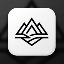
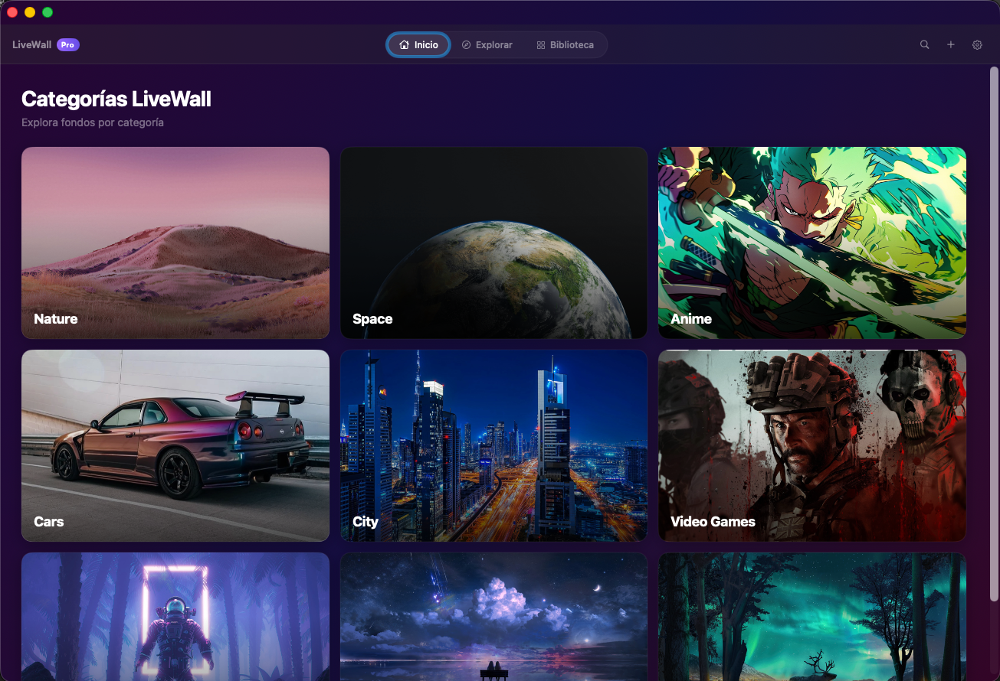
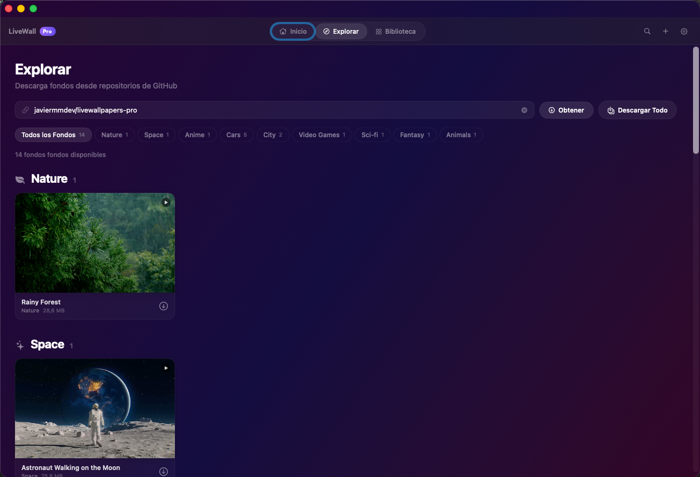
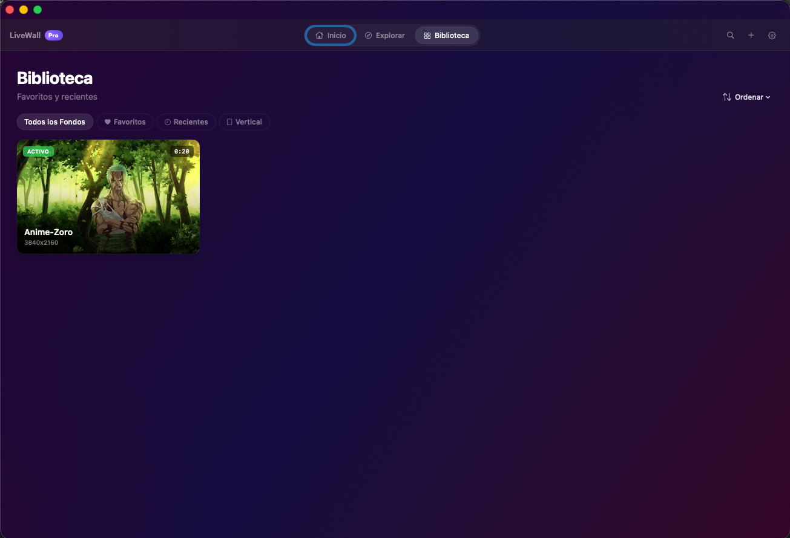
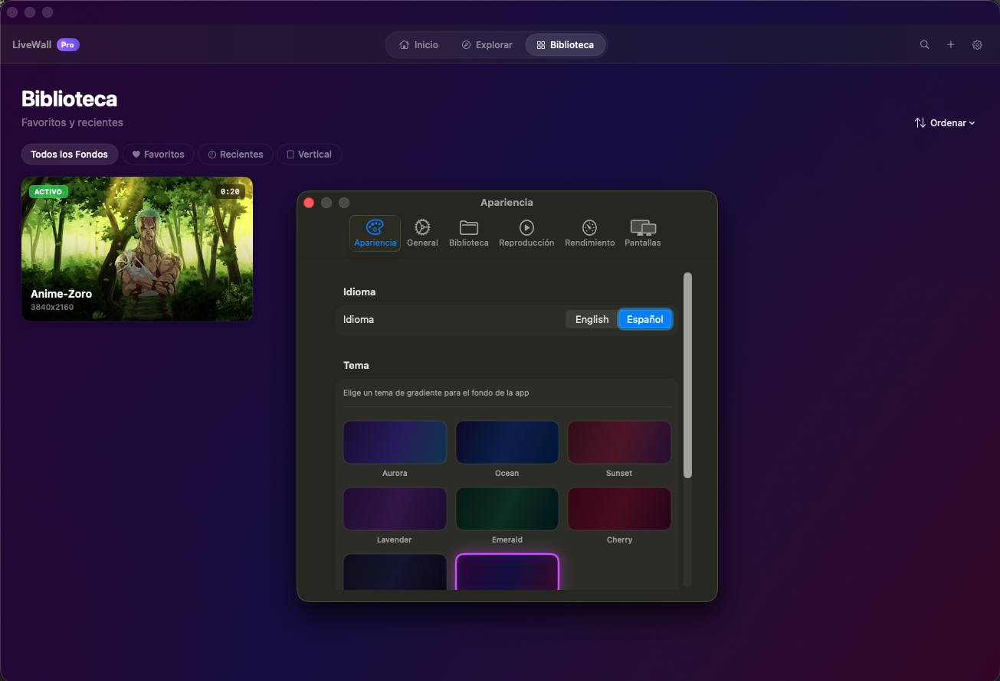
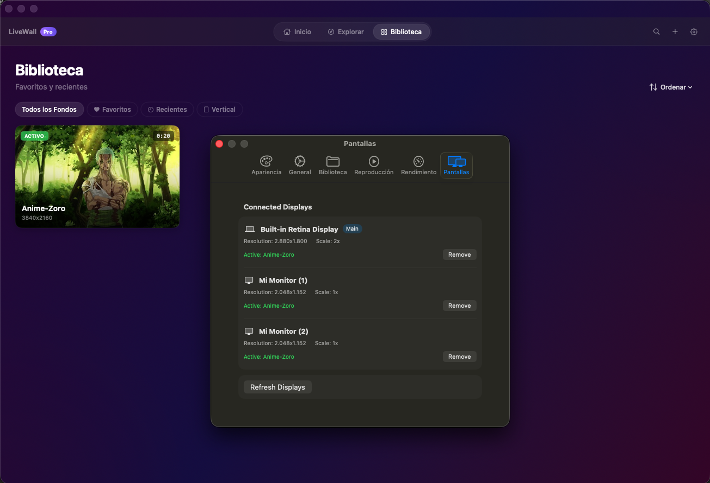

<div align="center">
  
  <h1>LiveWall Pro</h1>
  <p>Set stunning live wallpapers on your macOS desktop — powered by video.</p>

  
  
  
  

  <br /><br />

  <a href="https://github.com/javiermmdev/LiveWallPro/releases/latest">
    
  </a>

  <br /><br />

  

  <br /><br />

  

  <br /><br />

  

  <br /><br />

  

  <br /><br />

  

</div>

---

## Features

- **Live Wallpapers** — Play MP4/MOV videos as your desktop background across all connected displays
- **9 Categories** — Nature, Space, Anime, Cars, City, Video Games, Sci-fi, Fantasy, Animals
- **Explore & Download** — Browse and download wallpapers directly from any GitHub repository
- **Menu Bar Controls** — Quick access to playback, CPU/RAM/Battery monitoring
- **Glassmorphism UI** — Dark theme with customizable gradient presets (Aurora, Ocean, Sunset…)
- **English / Spanish** — Full localization, switch instantly from Settings
- **Power Aware** — Pauses automatically on low battery or when on battery power

## Installation

1. Download the **[latest release DMG](https://github.com/javiermmdev/LiveWallPro/releases/latest)** from GitHub
2. Open the DMG and drag **LiveWall Pro** into your Applications folder
3. Launch the app — grant **Screen Recording** permission when prompted
4. Import a video file or browse the Explore tab to download wallpapers

> Requires **macOS 26** or later.

## Wallpaper Repository

The default wallpaper source is [`javiermmdev/livewallpapers-pro`](https://github.com/javiermmdev/livewallpapers-pro).

Folder structure expected:
```
Nature/
  forest-rain.mp4
Space/
  nebula.mp4
Cars/
  gtr-r34.mp4
...
```

Any public GitHub repo following this structure works — just paste `owner/repo` in the Explore tab.

## Build from Source

```bash
git clone https://github.com/javiermmdev/LiveWallPro.git
cd LiveWallPro
open LiveWallPro.xcodeproj
```

Requires **Xcode 16+** and macOS 26 SDK.

## License

MIT © [javiermmdev](https://github.com/javiermmdev)
